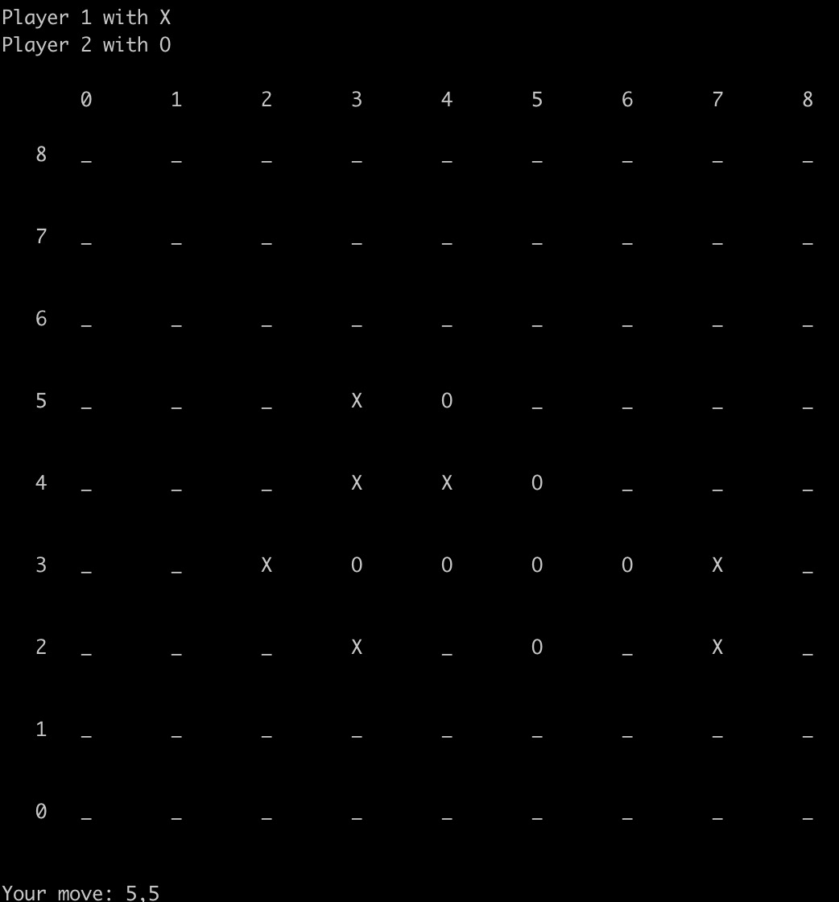

# Gomoku

### 介绍

”[五子棋]((https://en.wikipedia.org/wiki/Gomoku))“是一款大家耳熟能详的游戏，本项目实现一个无禁手五子棋Intelligent Agent :)

本次项目内容：
- 实现二人零和博弈最基本的minimax搜索
- 实现alpha-beta search等剪枝方法
- 设计评估函数并实现基于评估的截断搜索
- 实现蒙特卡洛搜索树 (MCTS) 搜索方法
- 了解AlphaZero的原理并进行基本尝试
  
### 文件结构

- minimax.py: 基于minimax的搜索方法实现。
- mcts.py: 基于mcts的搜索方法实现。
- alphazero.py: alphazero思想的实现。
- evaluation.py: 评估函数的实现。
  
### 使用说明

进入目录，输入以下命令运行五子棋游戏：

```
python play.py
```



游戏规则：通过键盘输入坐标 `A,B` 表示在第A行第B列落子，五子连珠即可获得胜利。

通过在指令中加入不同的参数，可以得到不同的棋盘大小以及获胜所需子数，具体地：
```
python play.py --width w --height h --n_in_row n
```
表示在 w$\times$h 的棋盘上以n子连珠为胜利。

代码中已经实现了一个最简单的```DummyPlayer```，它永远只会下在棋盘从上到下、从左到右第一个可以落子的位置。想要与AI进行对战，运行指令：
```
python play.py --player_1 Human --player_2 DummyPlayer
python play.py --player_1 DummyPlayer --player_2 Human
```
分别表示执先、后手与AI进行对战。

查看更详细的参数说明：
```
python play.py --help
```

#### 问题一：简单陈述 AI 的表现
* **MinimaxSearchPlayer**  
 $w=h=n=3$ 即井字棋时，无论先后手如何，AI 都有一组必不输策略，在对方是 Human， MCTSPlayer 与 MinimaxSearchPlayer 的情况下，MinimaxSearchPlayer 均未尝败绩。  
 $w=4,h=n=3$ 时，MinimaxSearchPlayer 运行时间过长，甚至先手第一棋时间超过了1个小时。  

* **AlphaBetaSearchPlayer**  
 $w=h=n=3$ 时，AlphaBetaSearchPlayer 可以快速落棋，并且未尝败绩。  
 $w=4,h=n=3$ 时，AlphaBetaSearchPlayer 运行时间相较于 MinimaxSearchPlayer 大大降低，先手第一棋时间小于一分钟，但是先手必赢。

* **CuttingOffAlphaBetaSearchPlayer**  
 $w=h=9,n=5$ 时，AI 具有一定的棋力，与业余棋手实力（比如我自己）相差不大，但是 Human 一旦失误，就会输掉对局。例如：它每次落棋都尽量落在正中间附近；它会主动构造活三、冲四等棋型，也会对对手的活三、冲四进行封堵；每次落棋时间都在 30s 内。

* **MCTSPlayer**    
 $w=h=9,n=5,c=1,n\_ playout=5000$ 时，AI 的棋力一般，与 Human，AlphaZeroPlayer，CuttingOffAlphaBetaSearchPlayer 对弈，有一定胜率，并且 AI 的落棋时间超过 30s。  
 $c=0.01$ 时，AI 的棋力无明显提升，落棋时间超过 30s。

* **AlphaZeroPlayer**  
 $w=h=9,n=5,c=1,n\_ playout=5000$ 时，AI 有一定棋力，策略不是最优，比如开局不下中间，对弈 CuttingOffAlphaBetaSearchPlayer，Human 胜率较低，落棋时间都在 30s 内。  
 $c=0.01$ 时，AI实力顶中顶，对弈 CuttingOffAlphaBetaSearchPlayer，Human 胜率较高，它每次落棋都尽量落在正中间附近，改善了MCTSPlayer，落棋时间都在 30s 内。

#### 问题二：需要说明 alpha-beta 搜索相比朴素 minimax 快了多少

$w=4,h=n=3$ 时，alpha-beta 搜索先手第一棋时间小于一分钟，但是朴素 minimax 先手第一棋时间超过一个小时，即使 $w=h=n=3$ 时，alpha-beta 搜索先手第一棋也明显快于朴素 minimax。

#### 问题三：需要说明评估函数的设计方案

```py
if end:
        if winner == -1:
            return 0
        else:
            return (1 if winner == player else -1)
if p == player:
                score += (160*info_p["live_four"] + 70*info_p["four"] + 25* info_p["live_three"] + 15* info_p["three"] + 10*info_p["live_two"] - info_p["max_distance"])/400
            else:
                score -= (150*info_p["live_four"] + 40*info_p["four"] + 20* info_p["live_three"] + 15* info_p["three"] + 10*info_p["live_two"] - info_p["max_distance"])/400
```
* 如果棋局结束，那么胜者得1，败者得-1，平局均为0。
* 活四接近于胜利，对方活四接近于失败，所以权值较高，在双方都将有活四的情况下，由于我方先手，所以我方活四权值高于对方。
* 同样的我方冲四可以立刻使对方围堵，打乱对方节奏，所以冲四的权值也较高，并且我方高于对方。
* 活三，冲三，活二依次权值降低，对下棋启发效果依次降低，由于权值较小，双方权值无需过度区分。
* 最后减去我方距离中心的最大距离，使每步棋都尽可能靠近中心，避免被阻挡。
* 最后除以一个较大的数，使得评估函数的取值固定到 $[-1,1]$ 之间。


#### 问题四：简述 MCTS 与 alpha-beta 搜索的对战结果并简单分析


$w=h=9,n=5,c=1/0.01,n\_ playout=5000$ 时，无论先后手，CuttingOffSearch 均胜过 MCTS，朴素的MCTS效果并不好，MCTS总是会下一些无关棋局的棋，且行棋较慢。这主要是由于在探索新节点时的随机游戏并不是一个很好的评估。

#### 问题五：对比 MCTS 和 AlphaZero，简述 AlphaZero 是否行棋更加合理


$w=h=9,n=5,c=0.01,n\_ playout=5000$ 时，无论先后手，AlphaZero 均胜过 MCTS，由于随机游戏不确定度太大，MCTS总是会下一些无关棋局的棋，导致输掉比赛。而 AlphaZero 不但下的快，而且比较符合棋手的身份，它每次落棋都尽量落在正中间附近；它会主动构造活三、冲四等棋型，也会对对手的活三、冲四进行封堵。所以 AlphaZero 行棋更加合理。


#### AlphaZeroPlayer VS CuttingOffAlphaBetaSearchPlayer
```
python play.py --player_2 AlphaZeroPlayer --player_1 CuttingOffAlphaBetaSearchPlayer --max_depth 1 --evaluation_func detailed_evaluation_func --c 0.01
python play.py --player_1 AlphaZeroPlayer --player_2 CuttingOffAlphaBetaSearchPlayer --max_depth 1 --evaluation_func detailed_evaluation_func --c 0.01
```


